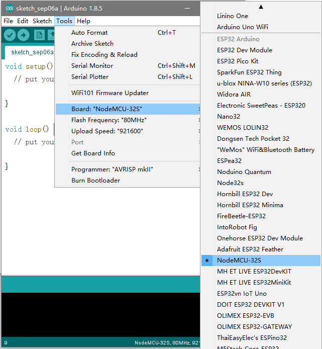

## Steps to install Arduino ESP32 support on Windows
### Tested on 32 and 64 bit Windows 10 machines

1. Download and install the latest Arduino IDE ```Windows Installer``` from [arduino.cc](https://www.arduino.cc/en/Main/Software)
2. Download development repository from [espressif/arduino-esp32](https://github.com/espressif/arduino-esp32)

    

3. Unzip the development repository to  ```[ARDUINO_SKETCHBOOK_DIR]/hardware/espressif/esp32```
    
    - Sketchbook Directory: Usually ```C:/Users/[YOUR_USER_NAME]/Documents/Arduino``` and is listed underneath the "Sketchbook location" in Arduino preferences.
        
        

    - Open ```[ARDUINO_SKETCHBOOK_DIR]/hardware/espressif/esp32/tools``` and double-click ```get.exe```
        
        

    - When ```get.exe``` finishes, you should see the following files in the directory

        

4. Plug your BPI:BIT board and wait for the drivers to install (or install manually [(CH341SER.EXE)](/drive) any that might be required)
5. Start Arduino IDE
6. Select your board in ```Tools > Board``` menu

    

7. Select the COM port that the board is attached to
8. Compile and upload (You might need to hold the boot button while uploading)

    
